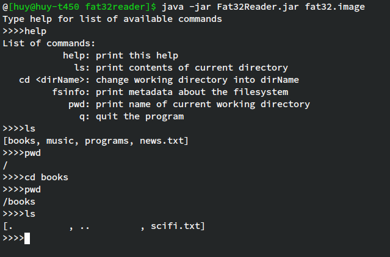

# fat32reader
Simple Java program to read a FAT32 filesystem

## Install
- Install Java 8 or newer on your system
- Download `Fat32Reader.jar`

## Usage

```
java -jar Fat32Reader.jar <Path to filesystem>
```
where \<Path to filesystem\> is the path to the device, something like /dev/sda1 or /dev/sdb on Linux. 

## Demo 

